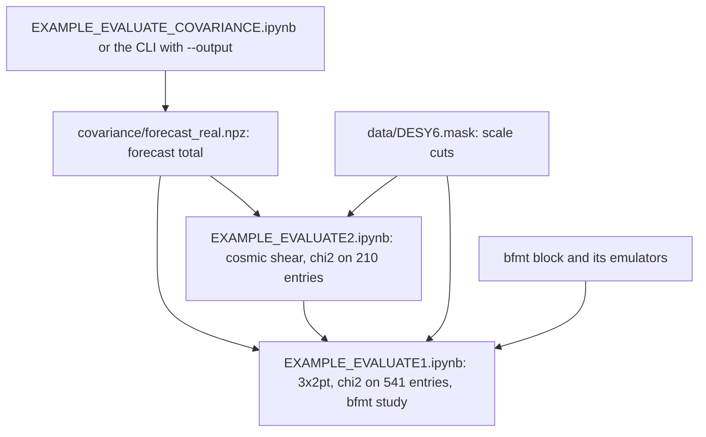

# Table of contents

1. [Overview](#overview)
2. [Installation](#installation)
3. [Computing data vectors](#data-vectors)
4. [Baryonic feedback](#baryons)
5. [Computing covariances](#computing_covariances)
6. [Running Hybrid Cosmolike-ML emulators](#hybrid-emulators)
7. [Exploring notebooks](#notebooks)
8. [Running the tests](#tests)
9. [Appendix](#appendix)
   1. [FAQ: Which inputs do the examples use?](#inputs)
   2. [FAQ: Which accuracy settings are available?](#accuracy)
   3. [FAQ: What does the model include?](#model)

# Overview <a name="overview"></a>

This project evaluates DES Y6 galaxy clustering, galaxy–galaxy lensing and
cosmic shear in [CoCoA](https://github.com/CosmoLike/cocoa). It provides Cobaya
data-vector likelihoods, a covariance forecast CLI, notebooks and tests.

> [!WARNING]
> **CLI for production; notebook wrappers for exploration.** Run production
> and HPC calculations from YAML through the `_interface` bindings.
> Notebook `_wrapper` APIs expose intermediate quantities through Armadillo,
> pybind11 and CARMA. Both routes call the same C kernels; copying and
> rearranging notebook arrays adds overhead.

> [!IMPORTANT]
> **The shipped likelihood uses dummy data.** `DESY6.dataset` selects a
> 1,300-entry dummy vector, identity covariance and all-ones mask. Its
> $`\chi^2`$ is not a fit to DES observations. The separate `DESY6.cov` has
> 1,690 entries and no verified mapping to this layout; it is neither
> activated nor cropped. See [the input inventory](data/README.md).

# Installation <a name="installation"></a>

Use the [main CoCoA installation recipe](https://github.com/CosmoLike/cocoa#required_packages_conda)
for dependencies. We assume the Cocoa Conda environment is active, the
shell is Bash, and the current folder is `cocoa/Cocoa/`. This project requires
the current shared CosmoLike core.

**Step :one:**: clone the project if it is not already installed.

```bash
git clone https://github.com/CosmoLike/cocoa_des_y6.git projects/des_y6
```

**Step :two:**: comment out `export IGNORE_COSMOLIKE_DES_Y6_CODE=1` in
`set_installation_options.sh` before starting Cocoa.

**Step :three:**: activate Cocoa's private environment and likelihood links.

```bash
source start_cocoa.sh
```

**Step :four:**: compile the project interface.

```bash
source ./projects/des_y6/scripts/compile_des_y6.sh
```

> [!WARNING]
> CosmoLike supports the optimized strict-IEEE default build and
> `COSMOLIKE_DEBUG_MODE`. `COSMOLIKE_AGGRESSIVE_MODE` is retired because its
> fast-math configuration produced incorrect covariance inverses. Unset it
> before compiling. Do not enable `-ffast-math`, `-Ofast`,
> `-funsafe-math-optimizations`, `-fassociative-math`, `-ffinite-math-only`,
> `-freciprocal-math`, `-fno-signed-zeros` or `-fno-trapping-math`.

# Computing data vectors <a name="data-vectors"></a>

We assume the project is enabled in `set_installation_options.sh` and
compiled, the Cocoa Conda environment is active, the shell is Bash, and the
current folder is `cocoa/Cocoa/`.

**Step :one:**: activate Cocoa's private environment.

```bash
source start_cocoa.sh
```

**Step :two:**: select the OpenMP team size.

```bash
export OMP_NUM_THREADS=8
```

**Step :three:**: evaluate the 3×2pt fiducial.

```bash
cobaya-run ./projects/des_y6/EXAMPLE_EVALUATE1.yaml --force
```

**Step :four:**: evaluate the cosmic-shear fiducial.

```bash
cobaya-run ./projects/des_y6/EXAMPLE_EVALUATE2.yaml --force
```

| Calculation | Written vector |
|---|---|
| 3×2pt | `EXAMPLE.modelvector` |
| Cosmic shear | `EXAMPLE_SHEAR.modelvector` |

> [!TIP]
> For the row ordering and dummy-data limits, see [which inputs the examples use](#inputs).

# Baryonic feedback <a name="baryons"></a>

The ordinary `EXAMPLE_EVALUATE1.yaml` already includes HMcode feedback through
`halofit_version: mead2020_feedback` and `HMCode_logT_AGN`. To explore an
external suppression model, [EXAMPLE_EVALUATE1_BARYONS.yaml](EXAMPLE_EVALUATE1_BARYONS.yaml)
uses **BCEmu** through Cocoa's `bfmt` provider and sets
`external_baryon_suppression: true` in the likelihood.

This example changes the underlying nonlinear prescription to the
gravity-only **Takahashi** spectrum. The external ratio is then applied once;
it must not be multiplied onto a spectrum that already includes HMcode
feedback. It also must not be combined with simulation-ratio or baryon-PCA
corrections in the same likelihood. To isolate the BCEmu effect, compare with
the same Takahashi baseline with external suppression disabled, not with the
ordinary HMcode example.

| BCEmu parameter | Example value |
|---|---:|
| `log10Mc_bcemu` | 13.32 |
| `mu_bcemu` | 0.93 |
| `thej_bcemu` | 4.235 |
| `gamma_bcemu` | 2.25 |
| `delta_bcemu` | 6.4 |
| `eta_bcemu` | 0.15 |
| `deta_bcemu` | 0.14 |

These fixed values demonstrate the interface; they are not a DES Y6 fit.
The provider samples 20 redshifts and 100 wavenumbers and uses unity above
its supported redshift range (`above_zmax: unity`). The sampler fiducial
has `mnu = 0.06 eV`. The [shared baryon provider guide](https://github.com/CosmoLike/cocoa/tree/main/Cocoa/external_modules/code/baryon_suppression)
explains the available models and their validity ranges.

`setup_cocoa.sh` and `compile_cocoa.sh` install `bfmt` and its emulators unless
their keys are set. Check that the lines below stay commented out in
`set_installation_options.sh` before running those scripts; they are by default.

      [Adapted from Cocoa/set_installation_options.sh shell script]
      #export IGNORE_PYSPK_CODE=1     # SP(k)
      #export IGNORE_BCEMU_CODE=1     # BCEmu and BCemu2025
      #export IGNORE_FBRE_CODE=1      # FlamingoBaryonResponseEmulator
      #export IGNORE_BACCOEMU_CODE=1  # BACCOemu
      #export IGNORE_BFMT_CODE=1      # Baryon Feedback Theory Block

`EXAMPLE_EVALUATE1_BARYONS.yaml` needs `bfmt` and BCEmu; the notebook study
[below](#baryons_notebooks) uses every model except BACCOemu.

We assume Cocoa and DES Y6 are installed and compiled, the Cocoa Conda
environment is active, the shell is Bash, and the current folder is
`cocoa/Cocoa/`.

**Step :one:**: activate Cocoa.

```bash
source start_cocoa.sh
```

**Step :two:**: evaluate the baryonic-feedback example.

```bash
cobaya-run ./projects/des_y6/EXAMPLE_EVALUATE1_BARYONS.yaml --force
```

The output is `projects/des_y6/EXAMPLE_BARYONS.modelvector`. The likelihood
still uses the shipped dummy data and identity covariance. See the
[data-vector tests](tests/data_vector/README.md) for the suppression and
restoration check.

## Feedback in the notebooks <a name="baryons_notebooks"></a>

Both evaluate notebooks run HMcode as `mead2020_feedback`. The shared CAMB helper
passes only the model name, so the notebooks use CAMB's default
$`\log_{10}(T_{\rm AGN}/{\rm K}) = 7.8`$, where the YAML sets `HMCode_logT_AGN: 7.7`.
Their feedback sections switch to the gravity-only Takahashi spectrum, so no
feedback is counted twice:

| Section | Notebooks | What it applies |
|---|---|---|
| *Baryonic feedback from tabulated simulations* | Both | Fixed power ratios of nine hydrodynamical simulations from `data/baryons_logPkR.h5`, through `ci.init_baryons_contamination`. |
| *Baryonic feedback from the `bfmt` theory block* | `EXAMPLE_EVALUATE1.ipynb` | Six parametric models through a minimal Cobaya model (CAMB, `bfmt` and the `one` likelihood): the three SP(k) relations, BCEmu, Flamingo and BCemu2025. |

The `bfmt` study needs the installation above and the forecast covariance of the
$`\chi^2`$ sections ([Exploring notebooks](#notebooks)). BACCOemu is commented out so
that the table lists the same six methods as the other projects' notebooks; it
would run here, since its `omega_baryon` training range starts at 0.04001, below
this project's `omegab = 0.049`. The table covers the 541 entries of `DESY6.mask`
against a synthetic data vector equal to the no-feedback prediction, so its
$`\chi^2`$, $`\Delta\chi^2`$ and $`\chi^2`$-of-the-shift columns coincide. In the executed
notebook the $`\chi^2`$ of the shift stays below one for every method, from 0.0111
(BCemu2025) to 0.8435 (SP(k) power law).

The $`\chi^2`$ sections also measure HMcode's own feedback term: against the
synthetic data vector, HMcode 2020 without feedback (`mead2020`) gives
$`\chi^2 = 0.6116`$ over the 541 3×2pt entries and $`\chi^2 = 0.1661`$ over the 210
cosmic-shear entries.

# Computing covariances <a name="computing_covariances"></a>

The production CLI saves G, SSC, cNG and total before scale cuts. It reads
[the covariance evaluate YAML](EXAMPLE_EVALUATE_COVARIANCE.yaml) and calls the shared C kernels.
This is a 1,300-entry analogous forecast; the likelihood still uses its
dummy inputs. The separate 1,690-entry supplied covariance is not activated.

We assume Cocoa and this project are installed, the Cocoa Conda environment
is active, the shell is Bash, and the current folder is `cocoa/Cocoa/`.

**Step :one:**: enable this project in `set_installation_options.sh` by commenting out
`export IGNORE_COSMOLIKE_DES_Y6_CODE=1` before activation.

**Step :two:**: activate Cocoa.

```bash
source start_cocoa.sh
```

**Step :three:**: enable covariance generation.

```bash
unset IGNORE_COSMOLIKE_DES_Y6_COVARIANCE
```

**Step :four:**: compile the project.

```bash
source ./projects/des_y6/scripts/compile_des_y6.sh
```

**Step :five:**: set the OpenMP team size.

```bash
export OMP_NUM_THREADS=8
```

**Step :six:**: compute the fixed YAML cosmology.

```bash
python ./projects/des_y6/covariance/compute_covariance.py ./projects/des_y6/EXAMPLE_EVALUATE_COVARIANCE.yaml
```

Use `--output PATH` for a separate output or `--overwrite` to replace an
existing computed archive. Paths are relative to `cocoa/Cocoa/`. Threads
come only from `OMP_NUM_THREADS`, never from the YAML; the runner fixes BLAS
to one thread. Ordinary likelihoods read their supplied covariance and do
not generate a new one.

Cobaya's YAML reader supplies the familiar `theory`, `params` and
`sampler: evaluate` syntax. This runner evaluates one fixed cosmology and
does not run MCMC. See the [covariance guide](covariance/README.md) for output
ordering, physics, Gaussian non-Limber/IA limits, plots and test commands,
and the [accuracy FAQ](#accuracy) for the separate numerical controls.

# Running Hybrid Cosmolike-ML emulators <a name="hybrid-emulators"></a>

> [!NOTE]
> These hybrid examples remain experimental. The checks below verify the
> workflow; assess emulator accuracy and posterior convergence for your analysis.

The `EXAMPLE_EMUL2` examples emulate the background expansion and matter
power spectra. CosmoLike still computes the survey projections, bias and
intrinsic-alignment contributions. Changing n(z) or nuisance parameters does
not require retraining a survey data-vector network.

The shared theory networks live in `external_modules/data/emultrf`. Install
them through the [main Cocoa emulator recipe](https://github.com/CosmoLike/cocoa#cobaya_base_code_examples_emul2).
These networks assume **mnu = 0.06 eV**; do not sample neutrino mass. Their
cold-matter power approximation is not a calibrated massive-neutrino halo
model. Check their training range before widening cosmological priors.

> [!IMPORTANT]
> The supplied likelihood data are dummy data with an identity covariance.
> Sampling examples demonstrate the workflow; they do not yield DES measurements.

We assume Cocoa and this project are installed, the Cocoa Conda environment
is active, the shell is Bash, and the current folder is `cocoa/Cocoa/`.

**Step :one:**: activate Cocoa.

```bash
source start_cocoa.sh
```

**Step :two:**: select the OpenMP threads per process.

```bash
export OMP_NUM_THREADS=4
```

**Step :three:**: remove GPU access on Linux; these examples use the CPU.

```bash
export CUDA_VISIBLE_DEVICES=""
```

**Step :four:**: evaluate the first hybrid example.

```bash
cobaya-run ./projects/des_y6/EXAMPLE_EMUL2_EVALUATE1.yaml --force
```

The YAML selects the CPU for the distance emulator. Keep BLAS at one thread
per MPI rank (`OPENBLAS_NUM_THREADS=1`, `MKL_NUM_THREADS=1`); on macOS also
use `VECLIB_MAXIMUM_THREADS=1`. The Python sampler entry points set these
BLAS limits before importing numerical libraries.

| Example | Configuration 1 | Configuration 2 |
|---|---|---|
| Fixed evaluation | [EXAMPLE_EMUL2_EVALUATE1.yaml](EXAMPLE_EMUL2_EVALUATE1.yaml) | [EXAMPLE_EMUL2_EVALUATE2.yaml](EXAMPLE_EMUL2_EVALUATE2.yaml) |
| Cobaya MCMC | [EXAMPLE_EMUL2_MCMC1.yaml](EXAMPLE_EMUL2_MCMC1.yaml) | [EXAMPLE_EMUL2_MCMC2.yaml](EXAMPLE_EMUL2_MCMC2.yaml) |
| Annealed minimization | [EXAMPLE_EMUL2_MINIMIZE1.py](EXAMPLE_EMUL2_MINIMIZE1.py) | [EXAMPLE_EMUL2_MINIMIZE2.py](EXAMPLE_EMUL2_MINIMIZE2.py) |
| Parameter profile | [EXAMPLE_EMUL2_PROFILE1.py](EXAMPLE_EMUL2_PROFILE1.py) | [EXAMPLE_EMUL2_PROFILE2.py](EXAMPLE_EMUL2_PROFILE2.py) |
| Nautilus sampling | [EXAMPLE_EMUL2_NAUTILUS1.py](EXAMPLE_EMUL2_NAUTILUS1.py) | [EXAMPLE_EMUL2_NAUTILUS2.py](EXAMPLE_EMUL2_NAUTILUS2.py) |

Configuration **1** uses `des_y6.combo_3x2pt`, NLA, and `DESY6.dataset`.
Configuration **2** uses `des_y6.cosmic_shear`, TATT, and `DESY6.dataset`.

The minimization, profile and Nautilus scripts read the corresponding
`EXAMPLE_EMUL2_EVALUATE1.yaml` or `2.yaml`; `--input` selects another evaluate
YAML. They require `cocoa_hybrid_sampling.py` from the matching shared core
revision. They do not maintain separate embedded cosmologies. `--check` evaluates
the specified fiducial and prints the sampled parameter order without sampling.
Use a new `--outroot` for each run; these scripts refuse to overwrite results.

### Cobaya MCMC

With the same CPU environment, run the first MCMC example. Use configuration
2 for the second likelihood listed above. Check chain convergence before
interpreting posterior constraints.

**Step :one:**: start Cobaya's hybrid MCMC.

```bash
mpirun -n 2 --bind-to none cobaya-run ./projects/des_y6/EXAMPLE_EMUL2_MCMC1.yaml
```

### Minimization, profiles and Nautilus

We assume Cocoa and this project are installed, the Cocoa Conda environment
is active, the shell is Bash, and the current folder is `cocoa/Cocoa/`.

**Step :one:**: check the hybrid setup before a long run.

```bash
python ./projects/des_y6/EXAMPLE_EMUL2_MINIMIZE1.py --check
```

**Step :two:**: search for a minimum with two MPI ranks.

```bash
mpirun -n 2 --bind-to none python ./projects/des_y6/EXAMPLE_EMUL2_MINIMIZE1.py --nstw 200 --outroot hybrid_min1
```

**Step :three:**: profile the first sampled parameter using that saved minimum.

```bash
mpirun -n 2 --bind-to none python ./projects/des_y6/EXAMPLE_EMUL2_PROFILE1.py --profile 0 --nstw 200 --numpts 11 --factor 1 --minfile ./projects/des_y6/chains/hybrid_min1.json --outroot hybrid_profile1
```

**Step :four:**: run Nautilus as an independent sampling example.

```bash
mpirun -n 2 --bind-to none python ./projects/des_y6/EXAMPLE_EMUL2_NAUTILUS1.py --nlive 1000 --neff 10000 --maxfeval 100000 --outroot hybrid_nautilus1
```

The annealed Emcee search follows the DES × Planck template. Its objective
is **−2 log posterior**, including nuisance and cosmological priors; the
profile is therefore a penalized profile, not a pure likelihood profile.
`--nstw` sets steps per walker per temperature. More steps and independent
starts are needed to assess whether a minimum is reliable.

`--profile` accepts a sampled-parameter name or its printed zero-based index.
`--factor` gives the half-width in proposal standard deviations, clipped to
the prior bounds. `--cov` accepts a covariance whose header lists the sampled
parameters in order; without it, the prior covariance sets the proposal.
The minimum JSON must come from the same evaluate YAML and parameter order.
Older plain-text minimum files are not accepted. Set any additional priors
in the input YAML; these scripts do not insert hidden cosmological priors.

Nautilus writes weighted GetDist-compatible rows and a JSON convergence
record. Reaching `--maxfeval` is not convergence. If the budget ends before
any posterior samples are retained, only the checkpoint and a JSON record
with `converged: false` are saved. Its prior transform uses
Cobaya's one-dimensional prior distributions; external prior factors enter
once as additional log weight. Evidence with unnormalized external priors
has that normalization limitation. These examples do not certify emulator
accuracy or posterior convergence.

### MPI across nodes

The two-rank commands above disable MPI binding for a portable local run.
For a cluster allocation, use the explicit binding and placement below.

> [!NOTE]
> **Running on more than one node.** With the Open MPI 4 launcher used here,
> `--mca pml ob1 --mca btl vader,tcp,self` selects shared memory within a node
> and TCP between nodes. The same transport list works across nodes.
>
> 1. **Network interface.** TCP must use an interface routable between compute
>    nodes. A common exclusion list is
>    `--mca btl_tcp_if_exclude lo,docker0,virbr0,ib0`; adapt it to the cluster.
>    Keep `ib0` if routable IP-over-InfiniBand is the intended network. These
>    examples exchange parameter vectors and scalar scores, so communication
>    volume is small; actual scaling still depends on the machine.
> 2. **Environment.** Remote ranks need the same Cocoa paths and libraries:
>    `ROOTDIR`, `PATH`, `LD_LIBRARY_PATH`, `PYTHONPATH`, `CONDA_PREFIX`, OpenMP
>    and BLAS settings, and `CLIK_PATH`/`CLIK_DATA`/`CLIK_PLUGIN` when used.
>    Slurm normally exports the submitting environment (`--export=ALL`).
>    Explicit `-x` options also forward these variables with SSH launchers.
>    Activate Cocoa before launching; build/download flags do not replace
>    runtime paths. All nodes must see the same files at the same paths.
> 3. **Slurm geometry.** Keep `ntasks-per-node × cpus-per-task` within the
>    allocated physical cores per node. Set `OMP_NUM_THREADS` to
>    `SLURM_CPUS_PER_TASK` and use `--map-by numa:pe=${OMP_NUM_THREADS}`.
>    The minimization, profile and Nautilus pool reserves one MPI rank as
>    coordinator; the remaining ranks evaluate the model.
>
> Open MPI 5 calls the shared-memory transport `sm`; use `sm,tcp,self` there.
> See the [Open MPI transport guide](https://docs.open-mpi.org/en/main/tuning-apps/networking/shared-memory.html),
> [TCP interface guidance](https://www.open-mpi.org/faq/?category=tcp), and
> [Slurm environment options](https://slurm.schedmd.com/sbatch.html#OPT_export).

Within a Slurm allocation, first activate Cocoa in Bash on the launch node.
The following steps assume Open MPI 4 and shared installation/data paths.
Omit optional CLIK exports if those variables are not set.

**Step :one:**: match OpenMP threads to the scheduler allocation.

```bash
export OMP_NUM_THREADS="${SLURM_CPUS_PER_TASK}"
```

**Step :two:**: bind each OpenMP team to its allocated cores.

```bash
export OMP_PROC_BIND=close
```

**Step :three:**: select core placement.

```bash
export OMP_PLACES=cores
```

**Step :four:**: disable dynamic team resizing.

```bash
export OMP_DYNAMIC=FALSE
```

**Step :five:**: keep OpenBLAS serial.

```bash
export OPENBLAS_NUM_THREADS=1
```

**Step :six:**: keep MKL serial.

```bash
export MKL_NUM_THREADS=1
```

**Step :seven:**: launch the hybrid minimizer across the allocated ranks.

```bash
"${CONDA_PREFIX}"/bin/mpirun -n "${SLURM_NTASKS}" \
  --mca pml ob1 --mca btl vader,tcp,self \
  --mca btl_tcp_if_exclude lo,docker0,virbr0 \
  --map-by numa:pe=${OMP_NUM_THREADS} --bind-to core --report-bindings \
  -x ROOTDIR -x PATH -x LD_LIBRARY_PATH -x PYTHONPATH -x CONDA_PREFIX \
  -x OMP_NUM_THREADS -x OMP_PROC_BIND -x OMP_PLACES -x OMP_DYNAMIC \
  -x OPENBLAS_NUM_THREADS -x MKL_NUM_THREADS -x CUDA_VISIBLE_DEVICES \
  python ./projects/des_y6/EXAMPLE_EMUL2_MINIMIZE1.py --nstw 200 --outroot hybrid_multinode
```

For a Planck likelihood add `-x CLIK_PATH -x CLIK_DATA -x CLIK_PLUGIN` when
those variables are defined. Follow the cluster's MPI module and Slurm
launch policy; do not oversubscribe a production allocation. Outside Slurm,
supply the hosts and slots with the cluster's `--hostfile` or `--host` recipe.


# Exploring notebooks <a name="notebooks"></a>

**Armadillo** was chosen to make a convenient Python API for notebook
exploration. This C++ library provides vectors, matrices and three-dimensional
arrays called cubes. A small interface layer connects them to NumPy through
**pybind11**, with **CARMA** handling array conversion. The notebooks expose
intermediate quantities; production calculations use the CLI interfaces.

We assume Cocoa and this project are installed, the Cocoa Conda environment
is active, the shell is Bash, and the current folder is `cocoa/Cocoa/`.

Compile the project first; the covariance notebook also needs the optional
covariance build described [above](#computing_covariances).

**Step :one:**: activate Cocoa.

```bash
source start_cocoa.sh
```

**Step :two:**: select the OpenMP team.

```bash
export OMP_NUM_THREADS=8
```

**Step :three:**: start Jupyter.

```bash
jupyter notebook --no-browser --port=8888
```

**Step :four:**: open the printed URL and choose a notebook below.

**Step :five:**: select **Kernel → Restart Kernel and Run All Cells**.

| Notebook | Contents |
|---|---|
| [EXAMPLE_EVALUATE1.ipynb](EXAMPLE_EVALUATE1.ipynb) | 3×2pt: $`C_\ell^{gs}`$, $`\gamma_t(\theta)`$, $`C_\ell^{gg}`$ with and without the Limber approximation, and $`w(\theta)`$, through wrapper functions defined in the notebook; parameter and binning changes, [tabulated-simulation feedback](#baryons_notebooks), `AccuracyBoost`, $`\chi^2`$ on the forecast covariance (541 entries) with quadrature and interpolation checks, and the [bfmt feedback study](#baryons_notebooks). |
| [EXAMPLE_EVALUATE2.ipynb](EXAMPLE_EVALUATE2.ipynb) | Cosmic shear: $`C_\ell^{EE}`$, with a check that NLA gives no B modes, and $`\xi_\pm(\theta)`$, through the same kind of wrappers; parameter and binning changes, tabulated-simulation feedback, `AccuracyBoost`, and $`\chi^2`$ on the forecast covariance (210 entries) with quadrature and interpolation checks. |
| [EXAMPLE_EVALUATE_COVARIANCE.ipynb](EXAMPLE_EVALUATE_COVARIANCE.ipynb) | G, SSC, cNG, total, separate 1h–4h matter trispectra and matrix diagnostics; writes the `covariance/forecast_real.npz` that the $`\chi^2`$ sections read. |

The shipped `DESY6.dataset` holds placeholders, so the $`\chi^2`$ sections of both
evaluate notebooks install three inputs of their own: the `total` matrix of
`covariance/forecast_real.npz`, the `DESY6.mask` scale cuts and a synthetic data
vector, the notebook's fiducial prediction. Run the covariance notebook first,
or write the same archive with the CLI:

```bash
python ./projects/des_y6/covariance/compute_covariance.py ./projects/des_y6/EXAMPLE_EVALUATE_COVARIANCE.yaml --output ./projects/des_y6/covariance/forecast_real.npz
```

Without that file the $`\chi^2`$ cells stop with `FileNotFoundError`. Start with
the cosmic-shear notebook: it introduces the stages and wrappers on one probe,
and `EXAMPLE_EVALUATE1.ipynb` extends them to the lens galaxies.



Choose the Python kernel from the activated Cocoa environment and restart it
after recompiling. The [covariance guide](covariance/README.md) explains the
forecast files, figures and refinement workflow.

# Running the tests <a name="tests"></a>

The tests check NLA/TATT vectors, input validation, cache consistency and
covariance assembly; [the test guide](tests/README.md) explains their scope.
We assume the project is enabled in `set_installation_options.sh` and its
covariance interface is compiled, the Cocoa Conda environment is active,
the shell is Bash, and the current folder is `cocoa/Cocoa/`.

**Step :one:**: activate Cocoa's private environment.

```bash
source start_cocoa.sh
```

**Step :two:**: run the data-vector tests.

```bash
python -m pytest ./projects/des_y6/tests/data_vector
```

**Step :three:**: run the separate covariance tests.

```bash
python -m pytest ./projects/des_y6/tests/covariance
```

# Appendix <a name="appendix"></a>

## FAQ: Which inputs do the examples use? <a name="inputs"></a>

The active [dataset descriptor](data/DESY6.dataset) preserves four source
bins, six lens bins and 26 angular bins from 2.5 to 995.267926 arcmin.
Both evaluate examples write the same ordering; the source-only example
sets unselected galaxy entries to zero.

| Block | Entries before cuts |
|---|---:|
| Cosmic shear $`\xi_+`$ | 260 |
| Cosmic shear $`\xi_-`$ | 260 |
| Galaxy–galaxy lensing $`\gamma_t`$ | 624 |
| Galaxy clustering $`w(\theta)`$ | 156 |

The n(z) files store **lower bin edges**; retain
`photoz_zmid_convention: 0`. The optional `DESY6.mask` selects 541 entries,
while the active dummy descriptor selects all 1,300. The supplied 1,690-entry
`DESY6.cov` has no verified row mapping to either selection.

## FAQ: Which accuracy settings are available? <a name="accuracy"></a>

Data-vector options belong to the selected `likelihood` block. Covariance
options belong to the evaluate YAML's `covariance` block. They use separate
names and settings; changing one does not refine the other.

| Data-vector setting | What it changes |
|---|---|
| `accuracyboost` | Overall interpolation-table resolution. |
| `integration_accuracy` | Quadrature resolution; refine independently of interpolation. |
| `internal_accuracyboost` | C-FAST-PT convolution grid. |
| `nonlimber_accuracyboost` | Non-Limber distance sampling. |
| `pk_z_refinement` | Nested redshift refinement of matter-power inputs. |
| `lmax` | Real-space angular-transform cutoff, where a real-space transform is used. |
| `kmax_boltzmann` | Requested Boltzmann power range; coordinate it with the theory settings. |

`adopt_limber_gg` and `adopt_limber_gs` choose a projection approximation.
`photoz_interpolation_type` chooses how n(z) is interpolated, while
`photoz_zmid_convention` describes the input coordinates. These are modeling
or input-convention choices, not interchangeable accuracy boosts.

The default data-vector power grid has 1,500 wavenumbers at boost 1.
Covariance alone uses `power_accuracyboost: 8` to prepare 11,993 nodes by
natural cubic interpolation before C linear lookup. Its `accuracy_boost`
refines tables and cutoffs; its `integration_accuracy` independently selects
quadrature levels 0–4. See the complete [covariance accuracy table](covariance/README.md#accuracy-settings).

CAMB's `theory.camb.extra_args.AccuracyBoost` controls CAMB, not CosmoLike.
Check interpolation, quadrature, input-power sampling and transform cutoffs
separately at fixed cosmology and measurement bins. Narrow n(z) overlaps
particularly require a quadrature check; increasing `accuracyboost` alone
is not that check. The [data-vector test guide](tests/data_vector/README.md)
and [covariance test guide](tests/covariance/README.md) state what each suite
actually verifies. A passing regression or a larger boost is not a general
claim of survey or Fisher convergence.

## FAQ: What does the model include? <a name="model"></a>

- **Data vectors:** preserve the project's cosmology, nuisance priors and photo-z shifts.
- **Gaussian covariance:** supports non-Limber clustering/galaxy–shear spectra and NLA/TATT.
- **SSC and cNG:** use massless neutrinos, zero IA, linear galaxy bias and Limber projection.

The data-vector YAMLs select NLA; `IA_model: 1` selects TATT with its
additional amplitudes in [the source parameters](likelihood/params_source.yaml).
The covariance YAML selects zero IA and a spherical-cap footprint. It is
an analogous forecast, not a reconstruction of the DES survey likelihood.
The DES Y6 calibration-mode likelihood and a survey-specific data-vector
emulator are not distributed here. The hybrid examples use shared theory networks.

Data-vector spectra use their own wrappers; covariance spectra use separate
all-pairs calculations.

The [Cosmosis comparison](https://github.com/joaoreboucas1/y6_code_comparison)
used altered spin prefactors. This project uses the shared core's standard
prefactors, so that comparison does not validate these settings.
